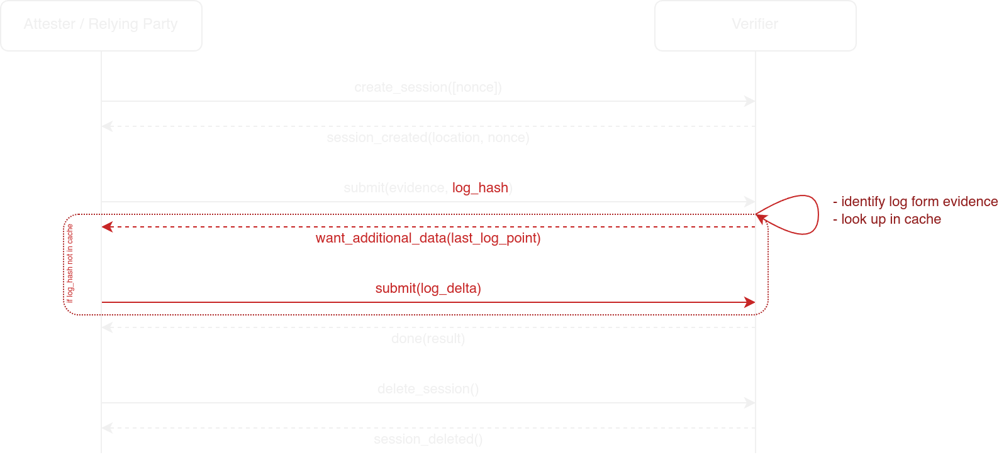
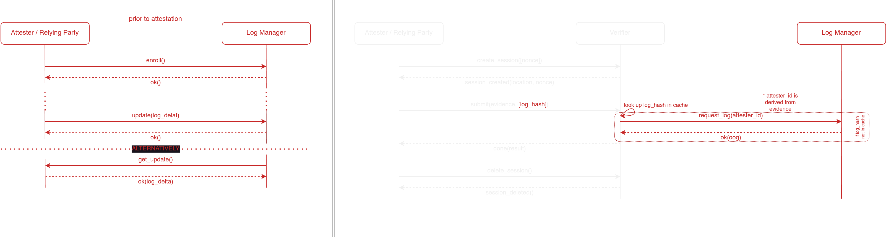

<!-- 
class: invert
_class: title invert
footer: © 2024 Veraison Project 
-->

# Event Logs in Veraison

---

<!-- paginate: true  -->

## Event Logs

- PCRs/RTMRs/HES contain hashes that are extended when changes to the system
  are made. Measurements of running components are not necessarily available
  directly.
- Event Logs are necessary in addition to the attested evidence in order to
  correlate with provisioned known good measurements.

---

## Existing Verification Flow

---

## Option 1: include log with evidence

---

## Option 1: include log with evidence

Modify the "token" submitted for evaluation to include both the evidence, and the 
event log (e.g. using [Conceptual Message Wrappers](https://www.ietf.org/archive/id/draft-ietf-rats-msg-wrap-05.html)).

Pros:

- Simple. No changes required to the current verification flow: the support is
  encapsulated entirely in the scheme handler being able to deal with  the new
  data format.

Cons:

- Need to transmit a potentially large log in its entirely on each attestation.

---

## Option 2: verifier requests log delta

---

## Option 2: verifier requests log delta

- Attester/RP sends evidence as before.
- Verifier realises it needs additional data to complete evaluation, and
  requests it from the attester/RP.
    - At this point, if attester/RP has attested before, and the previous log was cached,
      the verifier can send the last (scheme-specific) point (timestamp, record
      number, etc) for which it has cached entries, and only require the
      attester/RP to send the delta.

This would require:

- Modifying the REST API to allow asking for more data.
- Modifying the verifier to maintain persistence across verification sessions.

<!--
Note that the log delta cannot be sent in the first submission, as the verifier
needs to identify the last point that was cached using information in the
evidence (e.g. an instance/implementation id).
-->

---

## Option 2: verifier requests log delta

Pros:

- Minimise data transmission on repeat attestations.

Cons:

- Requires more intrusive changes to Veraison Services--changes to the API and
  the generic verifier, as well as scheme-specific code. (Although, both, the
  ability to request more data and inter-session persistent state, may
  potentially be useful to support other use cases).
- Still potentially sending a massive log if there is nothing in the cache (and
  now with an extra round-trip, compared to option 1).

---

## Option 3: log collected periodically from attester

---

## Option 3: log collected periodically from attester

1. Attester is registered/enrolled with the Log Monitor (LM).
    - LM is either a new Veraison node, or a services assumed by Veraison to
      exist elsewhere in the deployment.
2.
    1. Attester sends the log to the LM either periodically or at specified
       points (e.g. after an update),
    2. or LM periodically polls the attester for log updates.
3. Attestation flow between attester/RP and the verifier is unchanged. After
   receiving the evidence, the verifier uses is it to identify a log and
   requests it from the LM during the appraisal.

(Note: this is the approach taken by Keylime.)

---

## Option 3: log collected periodically from attester

Pros:

- Verification flow is unchanged.
- Large logs do not need to be transmitted in their entirely during
  attestation.

Cons:

- Makes assumptions about the behavior of the Attester:
    - Must be enrolled prior to attestation
    - Must either send logs or be listening for log requests outside of
      attestation
  and so would not fit most situations
- The log still needs to be transmitted between the LM and the Verifier
    - (unless LM is part of Veraison services, and verifier has direct access
      to its store).

---

## Conclusion

- For situations such live firmware update, where the log size is expected to
  be small, we don't need to do anything apart form implementing an appropriate
  scheme (Option 1).
- Option 2 would require significant changes to both the protocol, and the
  internal verifier flow, however are potentially useful beyond support for
  event logs.
- Option 3 is a significant departure from the present model assumed by
  Veraison. It requires either crating or assuming the existence of additional
  infrastructure. If the former, then its a major increase of Veraison's scope;
  if the latter, we may need to add an additional set of interfaces to the
  external services (though can potentially be contained within a scheme).

It should be noted that the three options are not mutually exclusive.
